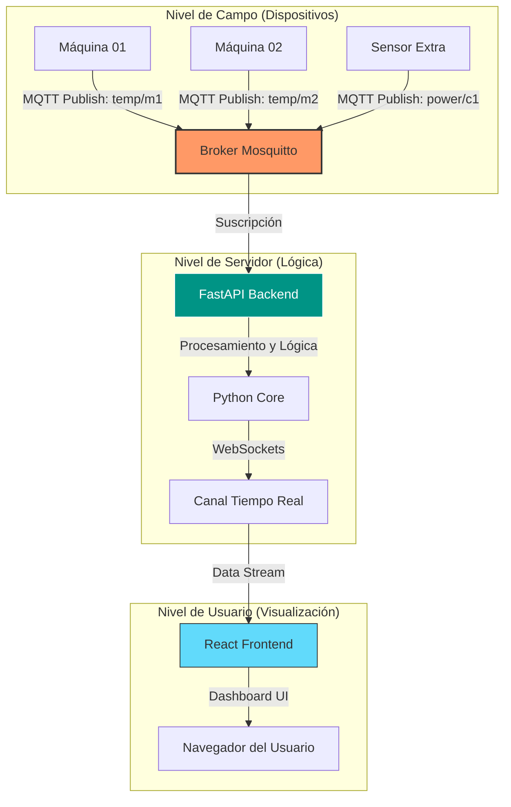

# React + TypeScript + Vite + FASTAPI

# 🚀 MQTTSync-Dash: Industrial IoT Real-Time Monitor

**MQTTSync-Dash** es un ecosistema Fullstack diseñado para la monitorización avanzada de telemetría industrial. Este sistema permite capturar datos de maquinaria, procesarlos a través de un servidor central y visualizarlos en tiempo real mediante una interfaz web moderna y tipada.

---

## 📊 Flujo de Datos y Arquitectura

El proyecto utiliza un modelo de mensajería **Publish-Subscribe** escalable y comunicación bidireccional mediante WebSockets.



---

## 🛠️ Stack Tecnológico

### **Frontend (Visualización)**
* **React 19 + TypeScript:** Interfaz de usuario robusta, modular y con tipado estricto.
* **Vite:** Herramienta de construcción de última generación para un desarrollo ultra rápido.
* **Tailwind CSS v4:** Estilizado mediante clases de utilidad para un diseño industrial "Dark Mode" profesional.
* **Lucide React:** Set de iconos optimizados para paneles de control y estados.
* **Recharts:** Librería de gráficas reactivas para mostrar tendencias de temperatura y consumo.

### **Backend (Procesamiento)**
* **FastAPI:** Framework de Python de alto rendimiento basado en estándares abiertos (OpenAPI).
* **Paho-MQTT:** Cliente para gestionar la conexión, suscripción y recepción de mensajes del Broker.
* **WebSockets:** Implementación para el envío de datos al frontend sin necesidad de refrescar la página.

### **Infraestructura de Red**
* **MQTT (Mosquitto):** Protocolo ligero ideal para entornos industriales con ancho de banda limitado.
* **Servidor Ubuntu:** Despliegue del Broker y servicios de backend.
* **Docker (Opcional):** Para el despliegue del Broker Mosquitto.

---

## 📋 Plan de Ruta (Roadmap)

- [x] **Fase 1: Estructura Base** - Configuración del monorepo y entorno de Git.
- [x] **Fase 2: Frontend Inicial** - Diseño del Dashboard con Tailwind y React TS (Datos simulados).
- [ ] **Fase 3: Backend FastAPI** - Creación del servidor, gestión de logs y cliente MQTT.
- [ ] **Fase 4: Broker MQTT** - Configuración de Mosquitto en Ubuntu y pruebas de conectividad.
- [ ] **Fase 5: Integración Real** - Conexión de WebSockets para que las gráficas se muevan con datos reales.
- [ ] **Fase 6: Seguridad y Optimización** - Implementación de autenticación JWT y caché con Redis para los históricos.

---

## 📂 Estructura del Proyecto

```text
MQTTSYNC-DASH/
├── frontend/           # Proyecto React + TypeScript (Vite)
│   ├── src/            # Componentes y lógica de UI
│   ├── tailwind.config.js
│   └── tsconfig.json
├── backend/            # Servidor FastAPI (Python)
│   ├── main.py         # Punto de entrada
│   └── requirements.txt
├── .gitignore          # Exclusiones de Git (node_modules, venv, .env)
└── README.md           # Documentación del proyecto

```

## 🚀 Instalación Rápida

Configuración del Frontend
```Bash
cd frontend
npm install
npm run dev
```

### Configuración del Backend (Próximamente)
```Bash
cd backend
python -m venv venv
# Activar venv:
# Windows: venv\Scripts\activate | Linux: source venv/bin/activate
pip install -r requirements.txt
```
---

> Desarrollado con el objetivo de modernizar la supervisión de procesos industriales. 🛠️