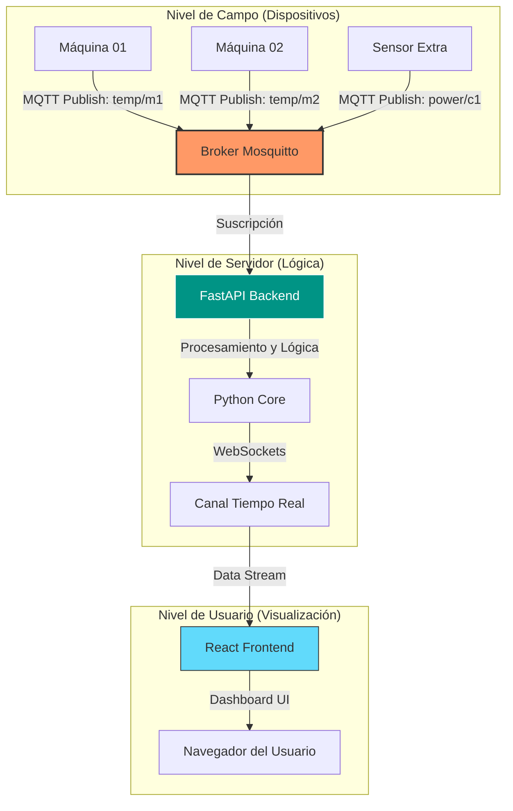

# React + TypeScript + Vite + FASTAPI

[](https://www.python.org/)
[](https://fastapi.tiangolo.com/)
[](https://react.dev/)
[](https://tailwindcss.com/)
[](https://www.postgresql.org/)
[](https://redis.io/)
[](https://mqtt.org/)
[](https://vercel.com/)
[]()

# 🚀 MQTTSync-Dash: Industrial IoT Real-Time Monitor

**MQTTSync-Dash** es un ecosistema Fullstack diseñado para la monitorización avanzada de telemetría industrial. El sistema permite la ingesta masiva de datos procedentes de múltiples máquinas y sensores, procesándolos en un entorno de alta disponibilidad y visualizándolos en tiempo real.

---

## 📊 Flujo de Datos y Arquitectura

El proyecto utiliza un modelo de mensajería **Publish-Subscribe** escalable y comunicación bidireccional mediante WebSockets.




---
## 🏗️ Arquitectura del Sistema

El sistema está diseñado bajo una arquitectura de **Vertical Slicing** y gestiona los datos de la siguiente manera:

1.  **Ingesta (MQTT):** Captura datos dinámicos de múltiples máquinas mediante topics jerárquicos (`factory/{machine_id}/telemetry/{device_id}`).
2.  **Procesamiento (FastAPI):** Un servicio especializado extrae la identidad de la máquina y del sensor, validando la integridad de los datos industriales (RSSI, Uptime, IPs locales, etc.).
3.  **Almacenamiento Dual:**
    * **Tiempo Real (Redis/Upstash):** Almacena el último estado de cada sensor para una respuesta instantánea (< 50ms).
    * **Histórico (Postgres/Neon):** Persiste cada lectura para análisis de tendencias y gráficas históricas.
4.  **Visualización (React + Tailwind v4):** Una interfaz moderna que se adapta dinámicamente a las máquinas detectadas en el sistema.

## 📡 Endpoints de la API

La API está documentada con Swagger y expone los siguientes puntos de acceso principales:

### Máquinas y Configuración
* `GET /telemetry/machines`: Devuelve una lista única de todas las máquinas (`machine_id`) registradas en el sistema.

### Datos de Telemetría
* `GET /telemetry/current/{machine_id}/{device_id}`: Obtiene el último estado conocido de un sensor específico desde la caché de **Redis**.
* `GET /telemetry/history/{machine_id}`: Recupera los últimos 50 registros (configurable) de una máquina específica desde **Postgres** para visualización de gráficas.

---

## 🧪 Cómo probar el sistema (Paso a Paso)

Para verificar el funcionamiento del ecosistema completo, sigue estos pasos:

### 1. Acceso a la Interfaz
Entra en la URL de producción (Vercel) o local: `http://localhost:5173`. Verás que el sistema detecta automáticamente las máquinas activas.

### 2. Simulación de Datos (MQTT Explorer / HiveMQ)
Para enviar datos como si fueras una máquina real:
1.  Abre **MQTT Explorer** o el [HiveMQ Web Client](http://www.hivemq.com/demos/websocket-client/).
2.  Conéctate al broker: `broker.hivemq.com` (Puerto 1883).
3.  Publica un mensaje en el siguiente formato:
    * **Topic:** `factory/prensa-01/telemetry/sensor-t01`
    * **Payload (JSON):**
        ```json
        {
          "status": "online",
          "temperature": 24.5,
          "pressure": 1.2,
          "rssi": -65,
          "local_ip": "192.168.1.50",
          "uptime": 3600
        }
        ```

### 3. Verificación
* **Frontend:** La card de la "prensa-01" debería aparecer o actualizarse con los nuevos valores.
* **API:** Accede a `/docs` en el backend para verificar que el JSON se ha persistido correctamente en la base de datos SQL.


---

## 🛠️ Desarrollo en Local

Para ejecutar el proyecto en tu máquina local y realizar pruebas, sigue estos pasos:

### 1. Configuración de Variables de Entorno (.env)

En local, el Frontend debe apuntar al servidor de Backend que corre en tu PC.

* **Frontend:** En `/frontend/.env`, asegúrate de tener:
    ```env
    VITE_API_URL=http://localhost:8000
    ```
* **Backend:** Asegúrate de tener configuradas las variables de conexión a Redis (Upstash) y Postgres (Neon).

### 2. Ejecución de los Servidores

Debes tener dos terminales abiertas:

* **Terminal Backend:**
    ```bash
    cd backend
    uv run uvicorn main:app --reload
    ```
    *El servidor estará disponible en `http://localhost:8000`*

* **Terminal Frontend:**
    ```bash
    cd frontend
    npm run dev
    ```
    *La aplicación web estará disponible en `http://localhost:5173`*

### 3. Despliegue (Importante)

Antes de hacer un `git commit` y subir los cambios a producción (Vercel), **debes volver a cambiar la URL** en el archivo `.env` del frontend para que apunte a la URL de producción:

```env
VITE_API_URL=[https://tu-proyecto-backend.vercel.app]
```

---


## 🛠️ Stack Tecnológico

### **Frontend (Visualización)**
* **React 19 + TypeScript:** Interfaz de usuario robusta, modular y con tipado estricto.
* **Vite:** Herramienta de construcción de última generación para un desarrollo ultra rápido.
* **Tailwind CSS v4:** Estilizado mediante clases de utilidad para un diseño industrial "Dark Mode" profesional.
* **Lucide React:** Set de iconos optimizados para paneles de control y estados.
* **Recharts:** Librería de gráficas reactivas para mostrar tendencias de temperatura y consumo.

### **Backend (Procesamiento)**
* **FastAPI:** Framework de Python de alto rendimiento basado en estándares abiertos (OpenAPI).
* **Paho-MQTT:** Cliente para gestionar la conexión, suscripción y recepción de mensajes del Broker.
* **WebSockets:** Implementación para el envío de datos al frontend sin necesidad de refrescar la página.

### **Infraestructura de Red**
* **MQTT (Mosquitto):** Protocolo ligero ideal para entornos industriales con ancho de banda limitado.
* **Postgres(NEON):** Database.
* **Vercel/Render:** Despliegue en Vercel como hosting.

---

## 📋 Plan de Ruta (Roadmap)

- [x] **Fase 1: Estructura Base** - Configuración del monorepo y entorno de Git.
- [x] **Fase 2: Frontend Inicial** - Diseño del Dashboard con Tailwind y React TS (Datos simulados).
- [x] **Fase 3: Backend FastAPI** - Creación del servidor, gestión de logs y cliente MQTT.
- [x] **Fase 4: Broker MQTT** - Configuración de Mosquitto en Ubuntu y pruebas de conectividad.
- [ ] **Fase 5: Integración Real** - Conexión de WebSockets para que las gráficas se muevan con datos reales.
- [ ] **Fase 6: Seguridad y Optimización** - Implementación de autenticación JWT y caché con Redis para los históricos.

---

## 📂 Estructura del Proyecto

```text
MQTTSYNC-DASH/
frontend/            # Proyecto React + TypeScript (Vite)
src/
├── assets/          # Imágenes, logos, fuentes.
├── components/      # Componentes "Átomos" (Botones, Inputs, el Navbar). 
│                    # Son los que se usan en todo el proyecto.
├── features/        # El corazón del Vertical Slicing.
│   ├── telemetry/   # Todo lo relacionado con los sensores.
│   │   ├── components/    # StatCard.tsx, TelemetryChart.tsx.
│   │   ├── hooks/         # useTelemetry.ts (tu lógica de Axios/Interval).
│   │   └── services/      # api.ts (funciones que llaman al backend).
├── context/         # Aquí irá el modo Oscuro/Claro (ThemeContext).
├── layouts/         # Estructuras de página (ej. MainLayout con el Navbar).
├── App.tsx          # Punto de entrada.
└── main.tsx         # Configuración de React.

```

### 📂 Estructura del Backend
```text
backend/                    # Servidor FastAPI (Python)
├── app/
│   ├── core/               # Configuración global, seguridad JWT, base de datos
│   └── modules/
│       ├── auth/           # Login, Logout, Registro y generación de Tokens
│       ├── users/          # Gestión de perfiles y permisos
│       ├── telemetry/      # EL CORAZÓN: Aquí va la comunicación con el Broker
│       │   ├── mqtt_service.py  # Conexión real con Mosquitto
│       │   ├── schemas.py       # Validar datos del sensor
│       │   └── service.py       # Procesar datos (ej: alertas si temp > 50)
│       ├── stream/         # Gestión de WebSockets (envío al Frontend)
│       └── devices/        # Gestión de las máquinas (ID, ubicación, estado)
├── main.py                 # Punto de entrada
└── requirements.txt
```


## 🚀 Instalación Rápida

Configuración del Frontend
```Bash
cd frontend
npm install
npm run dev
```

### Configuración del Backend (Próximamente)
```Bash
cd backend
python -m venv venv
# Activar venv:
# Windows: venv\Scripts\activate | Linux: source venv/bin/activate
pip install -r requirements.txt
```
---

> Desarrollado con el objetivo de modernizar la supervisión de procesos industriales. 🛠️

---

Desarrollado con ❤️ por Ángel Sánchez